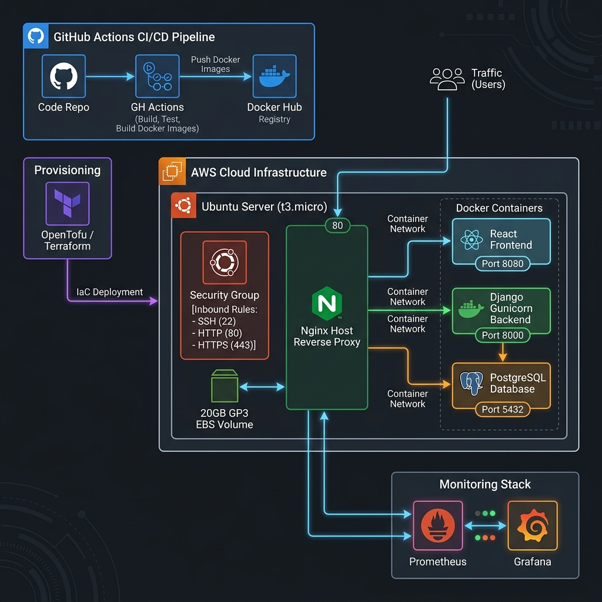

# RealWorld Application - Enterprise DevOps Infrastructure

مرحباً بك في وثائق البنية التحتية لمنظومة **RealWorld Application**. يهدف هذا الدليل الشامل لشرح المعمارية الفنية وكيفية تشغيل وأتمتة ومراقبة النظام باستخدام أفضل الممارسات في مجال الـ **DevOps**.

---

## 🏗️ معمارية النظام (System Architecture)

```text
AWS
 │
 ├── EC2
 │    │
 │    ├── Nginx
 │    ├── Django + Gunicorn
 │    ├── PostgreSQL
 │    └── React
 │
 ├── Prometheus
 └── Grafana

Terraform
    ↓
Infrastructure

Ansible
    ↓
Configuration

Docker
```



---

## 🛠️ التقنيات المستخدمة (Tech Stack)

- **Infrastructure as Code (IaC)**: OpenTofu / Terraform
- **Cloud Provider**: AWS (EC2 Ubuntu 24.04 LTS, Security Groups, 20GB GP3 EBS)
- **Configuration Management**: Ansible (Ansible Vault)
- **Containerization & Orchestration**: Docker & Docker Compose
- **Reverse Proxy & Web Server**: Host-level Nginx (Ports 80 / 443)
- **Backend Application**: Django (Gunicorn WSGI)
- **Frontend Application**: React SPA (Production Build Nginx)
- **Database**: PostgreSQL 15 (Alpine)
- **CI/CD Pipeline**: GitHub Actions (Lint, Test, Terraform Validate, Ansible Check, Docker Build, Trivy Security Scan, Deploy)
- **Monitoring & Observability**: Prometheus & Grafana

---

## 📚 وثائق الخدمات المخصصة (Detailed Documentation)

لكل خدمة وثيقة مستقلة ومخطط رسومي توضيحي مخصص داخل مجلد `docs/`:

- **[معمارية Docker والحاويات](docs/docker/DOCKER.md)**: تفاصيل عزل الحاويات وشبكة التواصل الداخلية.
- **[خط النشر الآلي CI/CD](docs/cicd/CICD.md)**: خطوات بناء البايبلاين، الاختبارات والنشر الآلي عبر GitHub Actions.
- **[البنية التحتية السحابية IaC](docs/infrastructure/INFRASTRUCTURE.md)**: شرح موارد AWS و OpenTofu و Ansible.
- **[منظومة المراقبة والتحليلات](docs/monitoring/MONITORING.md)**: تفاصيل إعداد Prometheus و Grafana والتنبيهات.

---

## 🚀 دليل التشغيل والتنفيذ المباشر (Quick Start Guide)

لتشغيل المشروع لأول مرة دون مواجهة أي مشاكل مسارات أو أسرار:

### 1️⃣ الاستنساخ والتهيئة הראשية (Clone & Preparation)

```bash
git clone https://github.com/Eng-m-devops/realworld.git
cd realworld
```

### 2️⃣ بناء البنية التحتية (Terraform / OpenTofu)

```bash
cd terraform
cp terraform.tfvars.example terraform.tfvars
# قم بتعديل القيم داخل terraform.tfvars حسب الحاجة
tofu init
tofu plan
tofu apply -auto-approve
```

سيتم إنشاء خادم EC2 وإخراج الـ Public IP تلقائياً، بالإضافة إلى توليد ملف `ansible/hosts.ini` ديناميكياً.

### 3️⃣ تهيئة وتجهيز الخادم (Ansible Automation)

```bash
cd ../ansible
cp vars.example.yml vars.yml
cp .env.example .env.prod

# 1. تجهيز بيئة السيرفر وتركيب Docker
ansible-playbook -i hosts.ini setup-server.yml

# 2. نشر التطبيق والـ Nginx الرئيسي
ansible-playbook -i hosts.ini playbook.yml

# 3. تشغيل منظومة المراقبة Prometheus & Grafana
ansible-playbook -i hosts.ini monitoring.yml
```

---

## 🔄 خط النشر الآلي (CI/CD Pipeline)

عند إجراء أي `git push` أو دمج في فرع `production`:

```text
Push ➔ Lint & Tests ➔ Terraform Validate ➔ Ansible Check ➔ Docker Build ➔ Trivy Scan ➔ Deploy
```

1. **Lint & Tests**: فحص جودة الكود واختبارات الوحدة للـ Backend والـ Frontend.
2. **Terraform Validate**: التحقق من سلامة وثائق البنية التحتية بـ OpenTofu.
3. **Ansible Check**: فحص صياغة الـ Playbooks والـ Roles.
4. **Docker Build**: بناء وحفظ صور الحاويات مع وسم Git Commit SHA.
5. **Trivy Scan**: فحص أمن الصور واكتشاف الثغرات.
6. **Deploy**: النشر التلقائي الآمن على خادم AWS EC2 عبر استراتيجية أتمتة الأنظمة وفحوصات السلامة التشغيلية (Automated deployment with health checks and container restart strategy).

---

## 🌐 اختبار واستقرار النظام (Health Verification)

بعد اكتمال عملية النشر، يمكنك استخدام الـ Public IP الخاص بخادمك (مثلاً `<EC2_PUBLIC_IP>`):

- **الواجهة الرئيسية**: `http://<EC2_PUBLIC_IP>/`
- **الـ API Endpoint**: `http://<EC2_PUBLIC_IP>/api/articles`
- **لوحة Grafana (عبر local tunnel أو proxy)**: `http://localhost:3000`
- **Prometheus (عبر local tunnel أو proxy)**: `http://localhost:9090`
