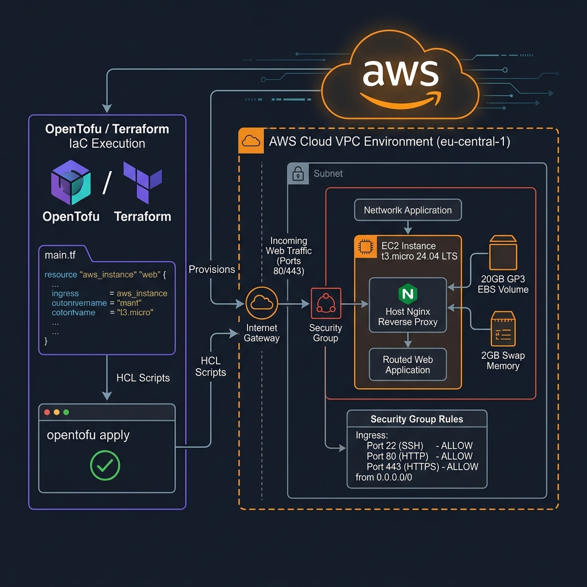

# البنية التحتية السحابية - OpenTofu / Terraform & Ansible

تدار جميع الموارد السحابية برمجياً بالكامل (Infrastructure as Code - IaC) لضمان سهولة إعادة الإنشاء والـ Scalability.

---

## مخطط البنية التحتية (Cloud Infrastructure Diagram)

---

## مكونات الموارد السحابية (Infrastructure Stack)

### 1️⃣ خادم EC2 (AWS Instance)

- **المكافئ البرمجي**: `aws_instance.my_first_ec2` في ملف `terrform/main.tf`.
- **النوع**: `t3.micro`.
- **نظام التشغيل**: Ubuntu Server 24.04 LTS (`noble`).

### 2️⃣ وحدة التخزين والذاكرة (EBS & Swap Memory)

- **قرص التخزين (EBS Volume)**: قرص من نوع `gp3` بسعة **20GB** يوفر سرعة قراءة وكتابة عالية للمستودعات والـ Logs.
- **الذاكرة العشوائية الإضافية**: تشغيل **2GB Swap Memory** حمايةً من ظاهرة Out Of Memory (OOM).

### 3️⃣ الجدار الناري (Security Group)

تم إعداد الجدار الناري `realworld-web-sg` لفتح المنافذ التالية فقط:

- **Port 22 (SSH)**: الوصول الإداري وخطوط CI/CD.
- **Port 80 (HTTP)**: تصفح الموقع العام.
- **Port 443 (HTTPS)**: الاتصالات المشفرة عبر شهادات SSL/TLS.

### 4️⃣ الأتمتة والتهيئة (Ansible Playbooks)

يتم تهيئة الخادم عبر Ansible بالخطوات الآتية:

1. `setup-server.yml`: تثبيت Docker، إعداد Nginx، وإنشاء الـ Swap.
2. `playbook.yml`: نسخ الإعدادات وتشغيل التطبيق.
