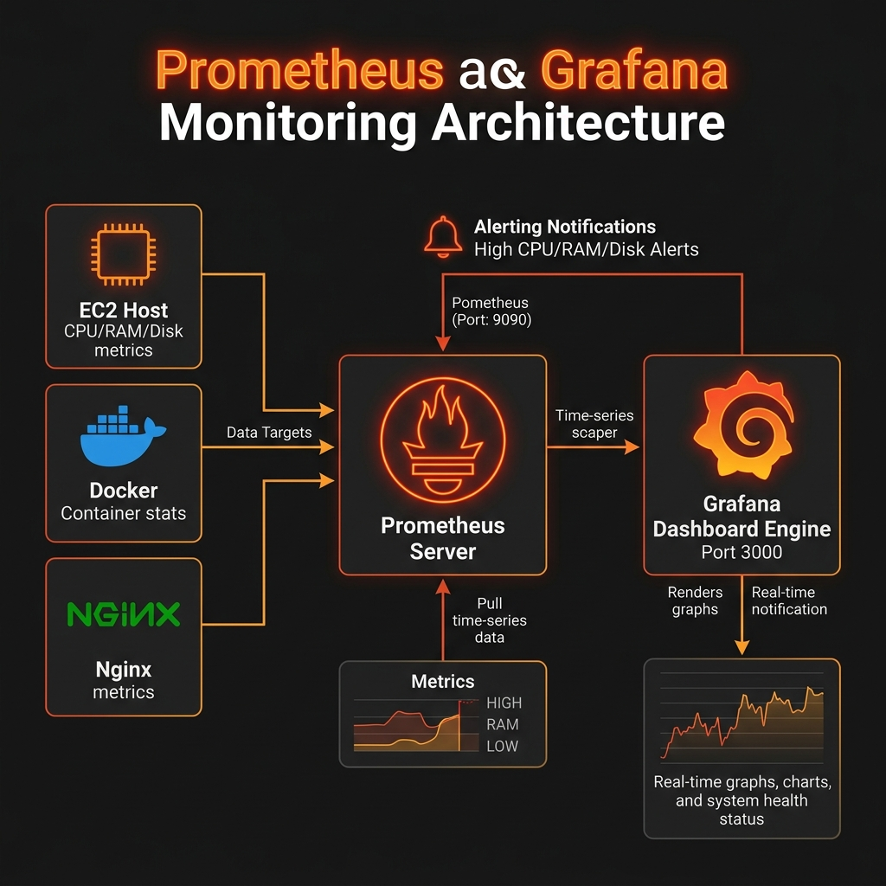

# 📊 منظومة المراقبة والمتابعة - Prometheus & Grafana

تخدم منظومة المراقبة تتبع صحة السيرفر والحاويات في الوقت الفعلي وضمان الاستجابة السريعة للأعطال.

---

## 📐 مخطط معمارية المراقبة (Monitoring Architecture Diagram)



---

## 🔍 مكونات منظومة المراقبة (Monitoring Components)

### 1️⃣ خادم Prometheus (Metrics Scraper)
* **المنفذ (Port)**: `9090`.
* **الوظيفة**: تجميع بيانات الأداء (Metrics) دورياً كل 15 ثانية من:
  * الخادم الرئيسي (CPU, RAM, Disk Space).
  * حاويات Docker وشبكاتها.
  * سيرفر Nginx ومعدلات الاستجابة.

### 2️⃣ خادم Grafana (Dashboards Engine)
* **المنفذ (Port)**: `3000`.
* **الوظيفة**: عرض الرسوم البيانية التفاعلية ومؤشرات الأداء (Health Dashboards).
* **التنبيهات (Alerting)**: إرسال تنبيهات فورية عند تجاوز استهلاك المعالج أو الذاكرة للحد المسموح.

---

## 🚀 تشغيل المنظومة (Ansible Command)
تُشغل منظومة المراقبة عبر الملف المخصص:
```bash
ansible-playbook -i hosts.ini monitoring.yml
```
