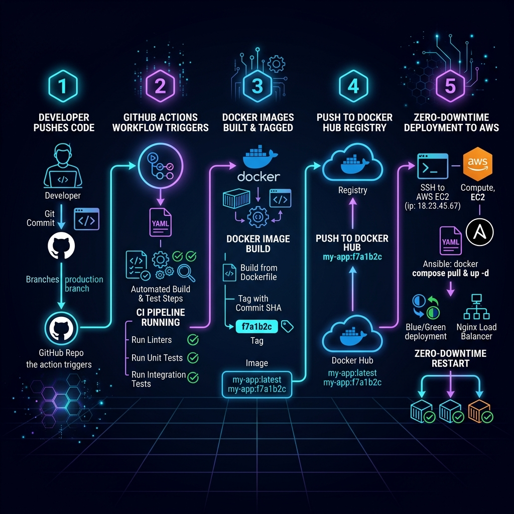

# 🔄 خط النشر والتكامل الآلي - GitHub Actions CI/CD Pipeline

تم إعداد خط النشر الآلي لتنفيذ عملية البناء والتجميع والنشر التلقائي فور رفع أي كود جديد لفرع الإنتاج `production`.

---

## 📐 مخطط تدفق خط النشر (CI/CD Pipeline Diagram)



---

## 🔁 مراحل التدفق (Pipeline Workflow Steps)

### 1️⃣ الرفع لـ GitHub (Trigger)
عند قيام المطور بـ `git push` إلى فرع `production` في مستودع الكود:
* يتم تفعيل ملف الـ Workflow المعرف في `.github/workflows/deploy.yml`.

### 2️⃣ الاختبار والبناء التلقائي (Build & Test)
* فحص جودة الكود واختبارات الوحدة (Linting & Unit Tests).
* بناء صور Docker للـ Backend والـ Frontend.
* وسم الصور برقم الإصدار (`git sha`) لتسهيل التتبع والـ Rollback عند الحاجة.

### 3️⃣ الرفع إلى Docker Hub (Registry Push)
* يتم رفع صور Docker الجاهزة بأمان إلى حساب **Docker Hub**.

### 4️⃣ النشر الفوري على AWS (SSH Deployment)
* يتصل GitHub Actions بسيرفر EC2 آمن عبر SSH باستخدام المفتاح المشفر المخزن في `Secrets`.
* يتم تنفيذ أمر تحديث الحاويات بدون توقف الخدمة:
  ```bash
  docker compose pull && docker compose up -d
  ```
