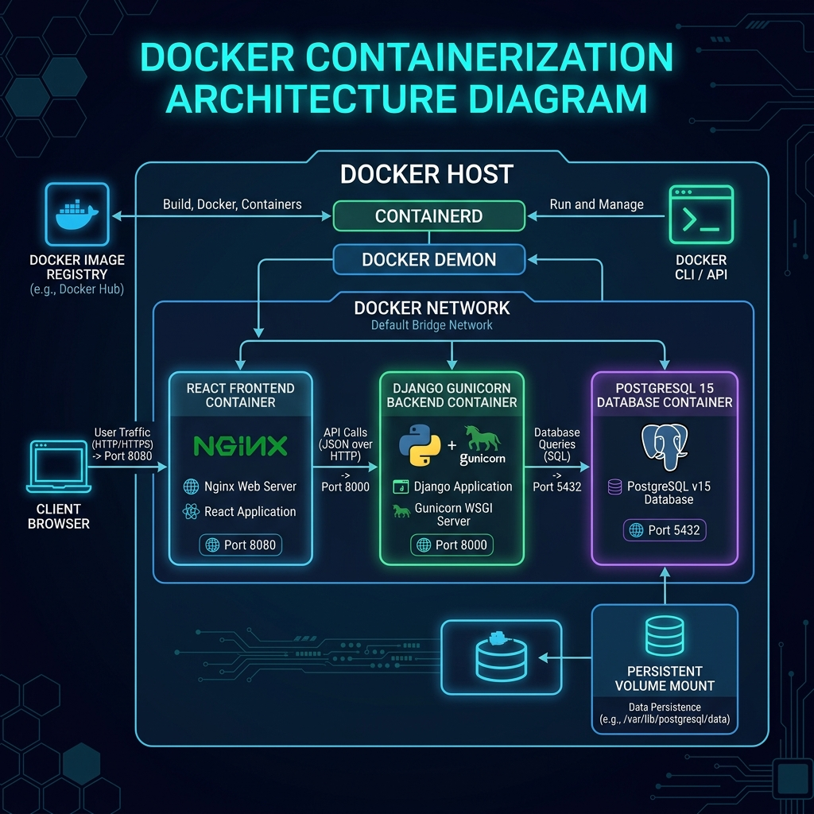

# 🐳 معمارية الحاويات - Docker & Docker Compose

تحتوي المنظومة على بيئة حاويات معزولة (Micro-containers Isolation) تُدار باستخدام **Docker Compose** لضمان استقلالية الخدمة وسهولة التطوير والتوسع.

---

## 📐 مخطط معمارية Docker (Docker Architecture Diagram)

---

## 🧱 مكونات الحاويات (Container Stack)

### 1️⃣ حاوية الواجهة الأمامية (`frontend-container`)
* **التكنولوجيا**: React SPA محزومة داخل سيرفر Nginx خفيف الوزن.
* **المنفذ الداخلي (Internal Port)**: `8080`.
* **الوظيفة**: تقديم ملفات الـ Static Frontend وتوجيه طلبات الـ Client إلى السيرفر الرئيسي.

### 2️⃣ حاوية الـ Backend (`backend-container`)
* **التكنولوجيا**: Django Python Application يعمل بـ **Gunicorn WSGI Server**.
* **المنفذ الداخلي (Internal Port)**: `8000`.
* **الوظيفة**: معالجة منطق العمل (Business Logic)، إدارة الجلسات والـ Authentication، وتقديم الـ RESTful API.

### 3️⃣ حاوية قاعدة البيانات (`postgres-container`)
* **التكنولوجيا**: PostgreSQL 15 (Alpine Edition).
* **المنفذ الداخلي (Internal Port)**: `5432`.
* **حفظ البيانات (Data Persistence)**: ترتبط بـ **Docker Named Volume** (`postgres_data`) لضمان عدم ضياع البيانات عند إعادة تشغيل الحاوية.

---

## 🔗 شبكة الحاويات (Docker Bridge Network)

تتصل جميع الحاويات عبر شبكة برمجية داخلية (`docker bridge network`).
* **عزل الأمان**: قاعدة البيانات ورابط الـ Backend لا تتوجه مباشرة للإنترنت الخارجي، بل تمر جميع الطلبات عبر الـ Host-level Nginx الذي يعمل كـ Reverse Proxy.
